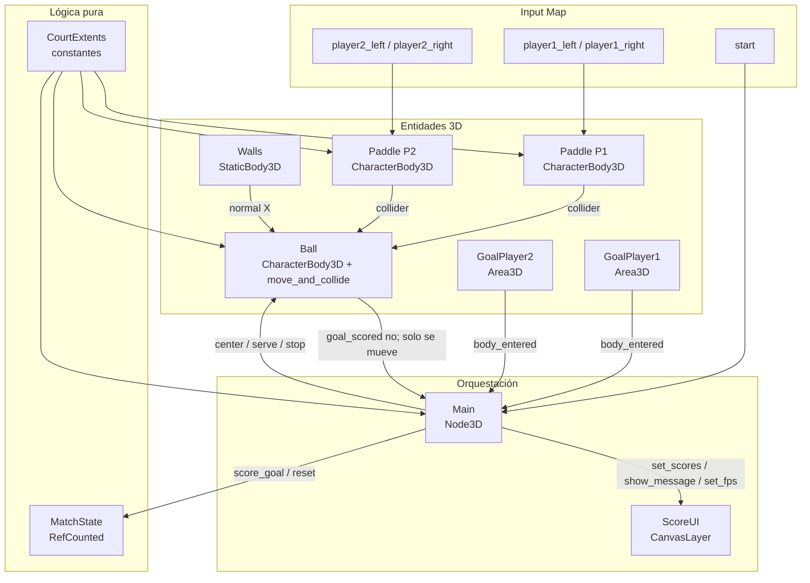
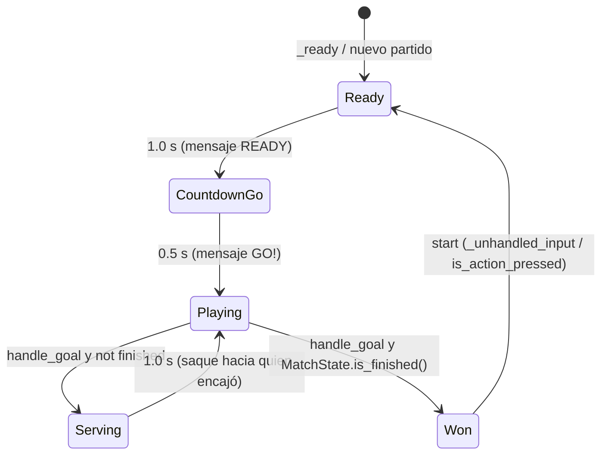

# VivesPong 3D 0.1 — Software Design Document

| Campo | Valor |
|---|---|
| **Título** | VivesPong 3D 0.1 — Software Design Document (SDD) + estrategia TDD |
| **Producto** | VivesPong 3D |
| **Proyecto Godot** | `ClonePong` (`application/config/name` actual en `E:\GameProjects\ClonePong\project.godot`) |
| **Versión del documento** | 0.1.3-draft |
| **Autor** | (por asignar) |
| **Fecha** | 2026-08-15 |
| **Estado** | Approved defaults locked |
| **Audiencia** | Ingenieros que implementarán 0.1 desde este documento, sin inventar comportamiento |
| **Motor** | Godot **4.7.1-stable**, features `4.7`, renderer **Forward Plus** |
| **Lenguaje** | GDScript 2.0 únicamente |
| **Física 3D** | Jolt (`physics/3d/physics_engine="Jolt Physics"`) |

Identificadores de código, rutas `res://`, `class_name` y acciones del Input Map se dejan en **inglés** tal como existirán en el repo. El resto del documento está en español.

---

## Overview

VivesPong 3D 0.1 es el primer juego jugable de la futura plataforma VivesCast: un Pong 3D local a dos jugadores, primitivas únicamente, ventana 1280×720 a 60 FPS. El repo `E:\GameProjects\ClonePong` ya tiene motor, plugin Godot AI MCP 3.1.5, `MatchState` (victoria a 10 goles) y un test GREEN. Falta la escena principal, las entidades 3D, el Input Map, la UI y el flujo saque/gol/victoria.

Este SDD fija arquitectura, números de pista, contratos de API, capas de colisión, máquina de estados de `Main`, y una **estrategia TDD** ejecutable con el runner existente (`res://tests/test_*.gd` + `McpTestSuite` + `godot-ai__test_run`). Un ingeniero debe poder implementar 0.1 sin inventar reglas de rebote, scoring ni mensajes.

---

## Background & Motivation

### Por qué existe este cambio

VivesCast necesita un primer título que demuestre el stack (Godot 4.7 + GDScript + Forward+ + Vulkan en ARM) en hardware objetivo Linux ARM64 / RK3588S / Mali-G610 / 4 GB RAM. VivesPong 3D es ese tech-demo: local versus, sin red, sin tienda, sin shaders custom.

### Estado actual (no rediseñar lo que ya funciona)

| Pieza | Estado |
|---|---|
| `application/run/main_scene` | **unset** — no hay escena principal |
| Escenas `.tscn` de juego | **ninguna** |
| Input Map | **vacío** (no hay claves `input/` en `project.godot`) |
| Ventana | stretch `canvas_items` / `expand`; **no** hay `viewport_width/height` 1280×720 |
| Renderer Windows | `rendering_device/driver.windows="d3d12"` (el blueprint pide Vulkan para VivesCast) |
| Autoload | `_mcp_game_helper="*res://addons/godot_ai/runtime/game_helper.gd"` (requerido para play-mode eval) |
| Plugin | `addons/godot_ai` v3.1.5, enabled |
| Dump C# | `Godot-MCP-6bd23f6a832ac5e75798d4b68e42155c6e3a187a/` — **no habilitar, no mover, no editar** |
| Git | **no inicializado**; `.gitignore` / `.gitattributes` son los defaults Godot 4 |
| Lógica | `res://scripts/match_state.gd` (`class_name MatchState extends RefCounted`) |
| Test | `res://tests/test_match.gd` (`suite_name` = `"match"`), `test_player_wins_on_tenth_goal` **GREEN** (7 asserts) |

`MatchState` ya implementado (no cambiar semántica, solo extender):

```gdscript
# res://scripts/match_state.gd
class_name MatchState
extends RefCounted

const WIN_SCORE: int = 10
var player1_score: int = 0
var player2_score: int = 0
var winner: int = 0   # 0 = en juego, 1 o 2 = ganador

func is_finished() -> bool:  # winner != 0
func score_goal(player: int) -> void
    # ignora si is_finished(); solo acepta player 1 o 2;
    # al alcanzar WIN_SCORE asigna winner
```

El test existente bloquea: 0-0 inicial, 9 goles de P1 no terminan, el décimo pone `player1_score == 10`, `is_finished() == true`, `winner == 1`. Los tests **precargan** el script (`const _MatchState := preload("res://scripts/match_state.gd")`) porque un `class_name` recién creado no entra en la tabla global hasta `filesystem_manage(op="scan")`.

### Dolores que 0.1 debe resolver

1. No se puede pulsar Play: no hay `main_scene`.
2. No hay pista, palas, pelota ni cámara — no hay loop jugable.
3. No hay Input Map: AGENTS.md prohíbe leer keycodes crudos en gameplay.
4. `MatchState` no tiene `reset()` — Start después de victoria no tiene API.
5. No hay UI de marcador / mensajes / FPS para el benchmark VivesCast.
6. Windows está en D3D12; el destino VivesCast es Vulkan + Linux ARM64.

---

## Goals & Non-Goals

### Goals (definición de “0.1 hecho”)

- Arranca en la pista (`res://scenes/Main.tscn` es `application/run/main_scene`).
- Dos palas controlables solo en X: teclado (A/D y flechas) y gamepad (stick/D-pad, device 0 y 1).
- Pelota se mueve sola, rebota en paredes laterales y palas, acelera un poco al golpear pala, tiene velocidad máxima.
- Gol = `Area3D` detrás de la pala; el rival suma 1; UI se actualiza; pelota al centro; espera 1.0 s; saque.
- Primero en `MatchState.WIN_SCORE` (10) gana: pelota se detiene, mensaje `PLAYER N WINS` + `PRESS START`.
- Start reinicia 0-0, pelota al centro, nuevo partido.
- Ventana 1280×720, 60 FPS en el PC de desarrollo, sin errores graves en el debugger.
- Exportable (preset Linux ARM64 preparado en la última fase; no bloquea el playable en Windows).
- Toda la lógica de puntuación vive en `MatchState`, no en `Ball`.
- Tests GREEN en el runner Godot AI, escritos en rojo primero.

### Non-Goals (fuera de 0.1 — no implementar)

- Multijugador online, cuentas, perfiles, tienda, logros.
- Rival IA.
- Física compleja (gravedad en la pelota, spin real, RigidBody3D).
- Assets externos, modelos importados, shaders custom, menú de gráficos, varias arenas.
- Sonido (PONK / TIK / SCORE / GO / WIN queda para una iteración posterior).
- C#, addons extra (GUT, WAT, etc.), editar `addons/godot_ai/` o el dump `Godot-MCP-*`.
- Varios modos de juego, pause menu, replay, partículas, post-process.

### Fases de producto (rebanadas; el orden de implementación es **solo** `## PR Plan`)

Las fases describen *qué* debe existir al final de 0.1, no el orden de merge. El orden autoritativo es PR-0 → PR-9 (PR-6a / PR-6b son dos merges).

| Fase | Contenido | Criterio de salida | PRs que la cierran |
|---|---|---|---|
| 1 | Pista, palas, pelota, colisiones, teclado | Pelota rebota; dos palas se mueven con A/D y flechas | PR-3 + PR-4 + PR-6b |
| 2 | Goles, marcador, saque, victoria, reset | Partido a 10; Start reinicia | PR-5 + PR-6a + PR-6b |
| 3 | Gamepad | Device 0 = P1, device 1 = P2 (stick + D-pad) | PR-7 |
| 4 | Presentación | Título, mensajes, paleta retro, FPS + frame time | PR-5 (lógica HUD) + PR-8 |
| 5 | Export VivesCast | Preset Linux ARM64 / Vulkan; ventana 1280×720 bloqueada | PR-9 |

---

## Proposed Design

### 1. Separación de responsabilidades

Cuatro piezas, una responsabilidad cada una. **Prohibido** meter reglas de gol dentro de `Ball`.



| Tipo | Script | Escena | Rol |
|---|---|---|---|
| Pura | `scripts/match_state.gd` | — | Marcador, victoria, reset. Cero nodos. |
| Pura | `scripts/court.gd` | — | Constantes de pista (una sola fuente de números). |
| Input + clamp | `scripts/paddle.gd` | `scenes/Paddle.tscn` | Lee Input Map, mueve solo X, clampea. |
| Cinemática | `scripts/ball.gd` | `scenes/Ball.tscn` | Avanza, rebota, acelera. **No puntúa.** |
| Orquestación | `scripts/main.gd` | `scenes/Main.tscn` | Señales de gol, saque, UI, Start. |
| Presentación | `ui/score_ui.gd` | nodos bajo `Main/UI` | Título, scores, mensaje, FPS. `class_name ScoreUI` (nombre de `AGENTS.md`). |

### 2. Sistema de coordenadas

Convención fija (no negociable en 0.1):

| Eje | Significado | Origen |
|---|---|---|
| **X** | Lateral. Las palas **solo** viajan en X. | 0 = eje central de la pista |
| **Y** | Arriba. Pelota Y bloqueada. Cámara elevada. | 0 = suelo |
| **Z** | Largo de la pista. Viaje principal de la pelota. | 0 = línea central |

- **Player1** defiende el extremo **−Z** (pala en `z = -PADDLE_Z`).
- **Player2** defiende el extremo **+Z** (pala en `z = +PADDLE_Z`).
- `GoalPlayer1` está **detrás** de Player1 (más negativo en Z): si la pelota entra, **anota Player2**.
- `GoalPlayer2` está **detrás** de Player2 (más positivo en Z): si la pelota entra, **anota Player1**.

```
            -X                         +X
             |                          |
        LeftWall                    RightWall
             |                          |
  -Z  GoalPlayer1  [P1 pala]                    ← anota P2
             |                          |
             |         (0,0,0)          |
             |       CenterLine         |
             |          Ball            |
             |                          |
  +Z                    [P2 pala]  GoalPlayer2  ← anota P1
```

### 3. Números de pista (contrato cuantitativo)

Una sola fuente: `res://scripts/court.gd`, `class_name CourtExtents`. Los `@export` de las escenas **deben** inicializarse a estos valores. No hay números mágicos en `_physics_process`.

Estos metros y velocidades son el contrato de pista de 0.1, **decidido por el usuario el 2026-08-15** (OQ-1.A, OQ-5.A). `AGENTS.md` fija 1280×720, victoria a 10, palas en Z, Input Map y primitivas; **no** fijaba 8.0 / 0.5 / 20.0 ni el tamaño. El prompt de producto (fuera del repo) proponía dirección inicial `Vector3(0.5, 0.0, 1.0)`, speed 8.0 e increment 0.5; el techo 20.0, el delay 1.0 s y los metros 12×20 quedan cerrados aquí. `test_court.gd` los sella.

| Constante | Valor | Unidad | Justificación |
|---|---|---|---|
| `HALF_WIDTH` | `6.0` | m | Default SDD. Ancho jugable 12 m. A 1280×720 con cámara arcade se lee entero. |
| `HALF_LENGTH` | `10.0` | m | Default SDD. Largo 20 m. Ida pala-pala ≈ 18 m. |
| `FLOOR_Y` | `0.0` | m | Suelo visual. |
| `WALL_HEIGHT` | `0.8` | m | Visible, no tapa la cámara. |
| `WALL_THICKNESS` | `0.3` | m | Cara interna en `x = ±HALF_WIDTH`. |
| `WALL_CENTER_Y` | `0.4` | m | `WALL_HEIGHT / 2`. Centro del box de pared. |
| `GOAL_SIZE` | `Vector3(12.6, 1.2, 1.0)` | m | Cubre el ancho de pista + margen; alto que envuelve la pelota. |
| `GOAL_CENTER_Y` | `0.6` | m | `GOAL_SIZE.y / 2`. La esfera en `y = 0.25` queda dentro. |
| `GOAL_Z` | `10.5` | m | `HALF_LENGTH + GOAL_SIZE.z / 2`. |
| `PADDLE_SIZE` | `Vector3(2.4, 0.4, 0.3)` | m | 20 % del ancho: ratio clásico de Pong. |
| `PADDLE_Z` | `9.0` | m | 1 m por dentro del fondo, delante del `Area3D` de gol. |
| `PADDLE_Y` | `0.3` | m | Apoyada sobre el suelo visual (centro del box). |
| `PADDLE_SPEED` | `10.0` | m/s | Cruza la pista (~9.6 m de recorrido útil) en ~1.0 s. |
| `BALL_RADIUS` | `0.25` | m | Esfera legible; `SphereMesh` + `SphereShape3D`. |
| `BALL_Y` | `0.25` | m | Centro a radio: flota sobre el suelo, Y **nunca** cambia. |
| `BALL_START_SPEED` | `8.0` | m/s | Default SDD (prompt de producto). Tiempo pala-pala ≈ 18/8 = **2.25 s**. |
| `BALL_SPEED_INCREMENT` | `0.5` | m/s | Default SDD. Por golpe de pala (no por pared). |
| `BALL_MAX_SPEED` | `20.0` | m/s | Default SDD. Techo. De 8.0 a 20.0 = 24 golpes de pala. Ida a tope ≈ **0.90 s**. |
| `BALL_START_DIR` | `Vector3(0.5, 0.0, 1.0)` | — | Default SDD. Normalizar al usar. Primer saque hacia +Z (Player2). |
| `PADDLE_BOUNCE_MAX_X` | `1.15` | — | En el borde, `atan(1.15) ≈ 49°` respecto a Z. |
| `SERVE_DELAY` | `1.0` | s | Default SDD. Espera post-gol / READY. |
| `GO_MESSAGE_DURATION` | `0.5` | s | Solo en saque de inicio de partido (mensaje `GO!`). |
| `CAMERA_POSITION` | `Vector3(0.0, 16.0, 18.0)` | m | Elevada, ligeramente hacia +Z. |
| `CAMERA_LOOK_AT` | `Vector3(0.0, 0.0, 0.0)` | m | Muestra pista completa, ambas palas, pelota, UI 2D. |
| `CAMERA_FOV` | `48.0` | ° | Arcade; no recorta las porterías a 1280×720. |
| `INPUT_DEADZONE` | `0.2` | — | Stick analógico. |

Recorrido útil de pala: `HALF_WIDTH - PADDLE_SIZE.x / 2 = 6.0 - 1.2 = 4.8` m a cada lado. `Paddle.clamp_x` usa exactamente eso (`playable_half_x()`).

Orígenes de colliders (centro del `CollisionShape3D` / nodo):

| Nodo | Centro `(x, y, z)` |
|---|---|
| `LeftWall` | `(-(HALF_WIDTH + WALL_THICKNESS / 2), WALL_CENTER_Y, 0)` = `(-6.15, 0.4, 0)` |
| `RightWall` | `(+(HALF_WIDTH + WALL_THICKNESS / 2), WALL_CENTER_Y, 0)` = `(6.15, 0.4, 0)` |
| `GoalPlayer1` | `(0, GOAL_CENTER_Y, -GOAL_Z)` = `(0, 0.6, -10.5)` |
| `GoalPlayer2` | `(0, GOAL_CENTER_Y, +GOAL_Z)` = `(0, 0.6, 10.5)` |

Cara interna de pared: `x = ±6.0`. Las porterías no solapan la pala (`PADDLE_Z = 9.0 < 10.0`). Helpers: `CourtExtents.wall_center(sign_x)` y `CourtExtents.goal_center(player)`.

Suelo visual: `BoxMesh` `size = Vector3(12.6, 0.1, 20.6)`, centro `(0, -0.05, 0)`. **Sin** `StaticBody3D` — la pelota no usa suelo (Y bloqueada).

Línea central: `BoxMesh` fino `size = Vector3(12.0, 0.02, 0.08)` en `(0, 0.01, 0)`, sin colisión.

### 4. Árbol de escena `Main.tscn`

```
Main (Node3D)                    [script: main.gd]
├── WorldEnvironment
├── DirectionalLight3D
├── Arena (Node3D)
│   ├── Floor          MeshInstance3D (BoxMesh)
│   ├── LeftWall       StaticBody3D + MeshInstance3D + CollisionShape3D
│   ├── RightWall      StaticBody3D + MeshInstance3D + CollisionShape3D
│   ├── CenterLine     MeshInstance3D
│   ├── GoalPlayer1    Area3D + CollisionShape3D   [%GoalPlayer1]
│   └── GoalPlayer2    Area3D + CollisionShape3D   [%GoalPlayer2]
├── Ball               instancia Ball.tscn         [%Ball]
├── Player1            instancia Paddle.tscn       [%Player1]
├── Player2            instancia Paddle.tscn       [%Player2]
├── Camera3D           current = true
└── UI                 CanvasLayer                 [%UI]
    ├── Title          Label   "VIVESPONG"
    ├── ScorePlayer1   Label                       [%ScorePlayer1]
    ├── ScorePlayer2   Label                       [%ScorePlayer2]
    ├── Message        Label                       [%Message]
    └── FPS            Label                       [%FPS]
```

Rutas de nodo: **solo** `$Child` o `%UniqueName`. Nunca rutas absolutas frágiles (`/root/Main/...`) en gameplay.

`Main.tscn` **no** se crea antes de PR-6b. `application/run/main_scene` se escribe a `res://scenes/Main.tscn` **en ese mismo PR**.

#### Checklist de `Main._ready` (producción; `configure_for_test` es el único camino que lo salta)

Orden fijo. Nada de esto es opcional en Play:

1. `match_state = MatchState.new()` y `_hud = %UI as ScoreUI`. Esta es la **única** construcción de `MatchState` en Play; Start no crea otra.
2. `%Player1.player_id = 1` y `%Player2.player_id = 2`. Las transformaciones de pala **viven serializadas** en `Main.tscn` (`P1` en `(0, PADDLE_Y, -PADDLE_Z)`, `P2` en `(0, PADDLE_Y, +PADDLE_Z)`). `Paddle._ready` (hijos **antes** que el padre) hace `home_z = global_position.z` sobre ese spawn. **No** teletransportar las palas en `Main._ready` (llegaría tarde y dejaría `home_z` obsoleto). Si un test o un reset recolocan: asignar `position` **y** `home_z = global_position.z`.
3. `%Ball.reset_to_center()`.
4. Conectar goles (binds del jugador que **anota**):
   - `%GoalPlayer1.body_entered.connect(_on_goal_body_entered.bind(2))` — gol detrás de P1 ⇒ anota P2.
   - `%GoalPlayer2.body_entered.connect(_on_goal_body_entered.bind(1))` — gol detrás de P2 ⇒ anota P1.
5. `$Camera3D.position = CourtExtents.CAMERA_POSITION`, `$Camera3D.fov = CourtExtents.CAMERA_FOV`, `$Camera3D.current = true`, `$Camera3D.look_at(CourtExtents.CAMERA_LOOK_AT)`.
6. `begin_match()`.

`configure_for_test(...)` sustituye los pasos **1–6**: asigna `match_state = p_match` (el objeto que pasa el test; no un `new()` extra), `_hud = p_hud`, palas y pelota ya construidos; **no** conecta `Area3D` ni toca la cámara; el test llama `begin_match()` a mano.

### 5. Decisión de cuerpos físicos

#### 5.1 Pelota: cinemática manual sobre `CharacterBody3D` + `move_and_collide`

La pelota **no** es `RigidBody3D`. Usa la propiedad **heredada** `CharacterBody3D.velocity` (ver Key Decision 16). **Prohibido** redeclarar `var velocity` en `Ball` (error de parse o shadow).

`move_and_collide` ya barre el segmento (`remaining`). El bucle de `budget = 4` es para **resto multi-rebote** (pared + pala en el mismo tick), no un CCD extra. Un solo sweep cubre una losa estática de 0.3 m a 20 m/s (33 cm/frame).

```gdscript
func _physics_process(delta: float) -> void:
	if not is_live:
		return
	var remaining: Vector3 = velocity * delta
	var budget: int = 4
	while remaining.length() > 0.0001 and budget > 0:
		budget -= 1
		var collision: KinematicCollision3D = move_and_collide(remaining)
		if collision == null:
			break
		_handle_collision(collision)
		# _handle_collision ya reescribió velocity (pared o pala).
		# El remainder se lanza en la NUEVA dirección; no usar remainder.bounce
		# (quedaría muerto al sobrescribir remaining).
		var leftover: float = collision.get_remainder().length()
		remaining = velocity.normalized() * leftover
	global_position.y = CourtExtents.BALL_Y
```

`_handle_collision`:

- Si el collider está en grupo `"walls"` (o la normal es casi eje X): `velocity = velocity.bounce(normal)` y `velocity.y = 0`. Velocidad **no** aumenta.
- Si el collider está en grupo `"paddles"`: calcular offset, reescribir dirección con `compute_paddle_bounce`, aplicar `accelerate`, emitir señal `paddle_hit` (para audio futuro; 0.1 no reproduce sonido).
- Cualquier otro collider: bounce genérico en XZ.

La matemática de rebote es **pura** y se testea sin árbol de escena (ver Estrategia TDD).

#### 5.2 Palas: `CharacterBody3D`, `MOTION_MODE_FLOATING`

Un solo camino de movimiento. `apply_axis` es **transform pura** (sin `move_and_slide`, sin Input): los tests `@tool` la llaman fuera de árbol.

```gdscript
func _ready() -> void:
	motion_mode = MOTION_MODE_FLOATING
	home_z = global_position.z


func physics_step(delta: float) -> void:
	if not input_enabled:
		return
	apply_axis(get_move_axis(), delta)
	global_position.y = CourtExtents.PADDLE_Y
	global_position.z = home_z


func apply_axis(axis: float, delta: float) -> void:
	var next_x: float = clamp_x(global_position.x + axis * speed * delta)
	global_position.x = next_x


func _physics_process(delta: float) -> void:
	physics_step(delta)
```

`motion_mode = MOTION_MODE_FLOATING` (no hay suelo, no hay snap, no hay gravedad). El clamp en X es la autoridad. **No** se usa `move_and_slide` en 0.1: las paredes laterales son tope de `clamp_x`, no un slide contra `StaticBody3D`. Eso mantiene los tests fuera de un `World3D`.

`home_z` lo fija `Paddle._ready` desde el Z de spawn. Default `0.0` solo existe **antes** de `_ready`; si un test no entra al árbol, asigna `home_z` a mano (suite 3).

#### 5.3 Paredes: `StaticBody3D`. Goles: `Area3D`

- Paredes: grupo `"walls"`, layer `WALLS`. Nunca se mueven.
- Goles: `monitoring = true`, `monitorable = false`. Señal `body_entered` → `Main._on_goal_body_entered(body, scoring_player)`.
- `Main` filtra `body is Ball` (o grupo `"ball"`). Ignora cualquier otro cuerpo.

#### 5.4 Por qué no RigidBody3D ni AnimatableBody3D (detalle en Key Decisions y Alternatives)

Resumen: RigidBody3D no es determinista ni testeable sin el servidor de física. `AnimatableBody3D` existe para empujar rígidos desde una animación; aquí la pelota no es rígida y la pala la mueve el jugador.

### 6. Rebote en pala (offset → ángulo)

```
hit_offset = (ball.global_position.x - paddle.global_position.x) / (PADDLE_SIZE.x / 2)
hit_offset = clampf(hit_offset, -1.0, 1.0)
#  0.0 = centro → salida casi paralela a Z
# ±1.0 = borde  → salida más abierta (hasta ~49°)
```

```gdscript
# ball.gd — función pura, testeable
static func compute_paddle_bounce(hit_offset: float, incoming_z_sign: float) -> Vector3:
	var ox: float = clampf(hit_offset, -1.0, 1.0)
	var z_out: float = -signf(incoming_z_sign)
	if z_out == 0.0:
		z_out = -1.0
	var dir: Vector3 = Vector3(ox * CourtExtents.PADDLE_BOUNCE_MAX_X, 0.0, z_out)
	return dir.normalized()


static func accelerate(speed: float, increment: float, max_speed: float) -> float:
	return minf(speed + increment, max_speed)


static func reflect_wall(velocity: Vector3, normal: Vector3) -> Vector3:
	var reflected: Vector3 = velocity.bounce(normal)
	reflected.y = 0.0
	return reflected
```

Contrato de tests:

| Impacto | `hit_offset` | Resultado |
|---|---|---|
| Centro | `0.0` | `dir.x == 0`, `dir.z` opuesto al incidente |
| Borde +X | `1.0` | `dir.x > 0`, ángulo respecto a Z ≈ `atan(1.15)` |
| Borde −X | `-1.0` | `dir.x < 0`, simétrico |
| Offset fuera de rango | `2.5` | se clampea a `1.0` |

Tras el rebote: `speed = accelerate(speed, BALL_SPEED_INCREMENT, BALL_MAX_SPEED)` y `velocity = dir * speed`.

### 7. Máquina de estados de `Main`



`MatchPhase` es `{ READY, COUNTDOWN_GO, PLAYING, SERVING, WON }`. **No** existe un estado `Scored`: `handle_goal` transiciona en el mismo frame de `PLAYING` a `SERVING` o `WON`.

| Estado | Pelota | Palas | Mensaje | Input Start |
|---|---|---|---|---|
| `READY` | Centro, `is_live = false` | Sí | `READY` | Ignorado |
| `COUNTDOWN_GO` | Centro, quieta | Sí | `GO!` | Ignorado |
| `PLAYING` | `is_live = true` | Sí | vacío | Ignorado |
| `SERVING` | Centro, quieta | Sí | `PLAYER N SCORES` | Ignorado |
| `WON` | Quieta donde esté o centro; `is_live = false` | **No** (`input_enabled = false`) | `PLAYER N WINS` + línea `PRESS START` | **Activo** |

`start` **solo** tiene efecto en `WON`. Sitio de poll de producción (único): `Main._unhandled_input` — ver §10. No hay pause menu en 0.1.

### 8. Flujo de gol (secuencia)

```mermaid
sequenceDiagram
  participant Ball
  participant Goal as GoalPlayer1 Area3D
  participant Main
  participant MS as MatchState
  participant UI as ScoreUI

  Ball->>Goal: entra (body_entered)
  Goal->>Main: _on_goal_body_entered(body, scoring_player=2)
  Main->>Main: ignorar si state != Playing
  Main->>Main: Ball.stop_and_center()
  Main->>MS: score_goal(2)
  Main->>UI: set_scores(p1, p2)
  alt MS.is_finished()
    Main->>UI: show_win(2)
    Main->>Main: phase = WON; paddles.input_enabled = false
  else
    Main->>UI: show_message("p2_scores")
    Main->>Main: phase = SERVING; serve_timer = 0
    Main->>Main: tick_phase acumula hasta SERVE_DELAY
    Main->>Ball: serve_toward(conceding_player=1)
    Main->>Main: phase = PLAYING
  end
```

`handle_goal` **nunca** pasa copy de pantalla a `show_message`. Claves: gol de P1 → `show_message("p1_scores")`; gol de P2 → `show_message("p2_scores")`; victoria → `show_win(scoring_player)` (ese método escribe `PLAYER N WINS` + `PRESS START`). Un string tipo `"PLAYER 2 WINS"` es key desconocida y deja el label vacío (`test_unknown_key_clears`).

Reglas de saque:

- **Primer saque del partido** (y cada reset): dirección `BALL_START_DIR` (hacia +Z / Player2), velocidad `ball.start_speed` (default `BALL_START_SPEED`).
- **Tras un gol**: saque **hacia el jugador que encajó** (el que acaba de recibir el tanto). Velocidad vuelve a `ball.start_speed` (el rally se reinicia; el incremento es intra-rally).
  - Gol de P1 → encajó P2 → dirección con `z > 0`.
  - Gol de P2 → encajó P1 → dirección con `z < 0`.
- Componente X del saque post-gol: `0.5` con el mismo signo que el último `BALL_START_DIR.x` (positivo), para no servir 100 % recto. Vector normalizado.

`Ball` expone:

```gdscript
signal paddle_hit(paddle: Node3D, hit_offset: float)

var is_live: bool = false
var speed: float = CourtExtents.BALL_START_SPEED
# velocity: heredada de CharacterBody3D — no redeclarar

func reset_to_center() -> void
func stop_and_center() -> void          # is_live = false; pos = (0, BALL_Y, 0); velocity = Vector3.ZERO
func serve(direction: Vector3) -> void  # is_live = true; speed = start_speed; velocity = direction.normalized() * start_speed
func serve_toward(player: int) -> void  # player 1 => z < 0; player 2 => z > 0
```

`serve` usa el `@export var start_speed` (default `CourtExtents.BALL_START_SPEED`), **no** el literal `8.0`. Tras un gol, `serve` / `serve_toward` también reasigna `speed = start_speed` (OQ-5.A). Los tests leen `ball.velocity` (propiedad heredada) y `ball.start_speed`.

`Ball` **no** llama a `MatchState`. `Ball` **no** conoce scores.

### 9. Capas y máscaras de colisión

Godot 4 guarda `collision_layer` / `collision_mask` como **bitmasks**, no como índices 1-based. Capa *n* (1-based, inspector) = bit *(n − 1)* = valor `1 << (n − 1)`.

Nombrar capas en `project.godot` (índice 1-based del inspector):

```
layer_names/3d_physics/layer_1="walls"
layer_names/3d_physics/layer_2="paddles"
layer_names/3d_physics/layer_3="ball"
layer_names/3d_physics/layer_4="goals"
```

| Nombre | Índice inspector | Bit | Valor bitmask |
|---|---:|---:|---:|
| `walls` | 1 | 0 | `1` |
| `paddles` | 2 | 1 | `2` |
| `ball` | 3 | 2 | `4` |
| `goals` | 4 | 3 | `8` |

| Cuerpo | Layer (índice) | Layer (bits) | Mask (índices) | Mask (bits) | Notas |
|---|---|---|---|---|---|
| Paredes | 1 walls | `1` | ninguna | `0` | Estáticas. `Ball.move_and_collide` las ve si **la pelota** tiene walls en su mask. |
| Palas | 2 paddles | `2` | ninguna (clamp es autoridad) | `0` | No necesitan mask: no usan `move_and_slide` contra paredes. |
| Pelota | 3 ball | `4` | 1 + 2 (walls + paddles) | `1 \| 2 = 3` | **No** incluir goals (bit 3): atraviesa el `Area3D`. |
| Goles | 4 goals | `8` | 3 (ball) | `4` | `monitoring = true`, `monitorable = false`. Mask `4`, **nunca** `3`. |

Unidireccional (docs 4.7): A detecta a B si el layer de B está en el mask de A. Por eso las paredes pueden tener mask `0`.

**Prohibido** asignar el entero crudo `3` creyendo que significa “capa ball”. `3` es walls+paddles (`bit0|bit1`). En código de escena/script usar:

```gdscript
ball.set_collision_layer_value(3, true)   # capa ball
ball.set_collision_mask_value(1, true)    # ve walls
ball.set_collision_mask_value(2, true)    # ve paddles
goal.set_collision_layer_value(4, true)
goal.set_collision_mask_value(3, true)    # ve ball (bit value 4)
```

En el inspector: marcar checkboxes, no pegar `3` en el campo crudo del gol.

Grupos: `"walls"`, `"paddles"`, `"ball"`, `"goals"`.

### 10. Input Map

Nunca `Input.is_key_pressed(KEY_*)` en gameplay. Solo acciones:

| Acción | Teclado | Gamepad |
|---|---|---|
| `player1_left` | `A` (`KEY_A`) | Device **0**: eje izquierdo X negativo + D-pad left |
| `player1_right` | `D` (`KEY_D`) | Device **0**: eje izquierdo X positivo + D-pad right |
| `player2_left` | `←` (`KEY_LEFT`) | Device **1**: mismo esquema |
| `player2_right` | `→` (`KEY_RIGHT`) | Device **1**: mismo esquema |
| `start` | `Enter` (`KEY_ENTER`) | Device 0 **y** device 1: `JOY_BUTTON_START` |

`deadzone = 0.2` en los eventos de eje.

`Paddle.get_move_axis()`:

```gdscript
func get_move_axis() -> float:
	var left_action: String = "player1_left" if player_id == 1 else "player2_left"
	var right_action: String = "player1_right" if player_id == 1 else "player2_right"
	return Input.get_axis(left_action, right_action)
```

PR-3 registra teclado. PR-7 añade los eventos de joypad a las **mismas** acciones (no se crean acciones nuevas).

#### Poll de `start` (único sitio de producción)

`handle_start_pressed()` es el entry testeable (los tests lo llaman directo, sin hardware). En Play, **solo** `Main` lee la acción, y solo así:

```gdscript
func _unhandled_input(event: InputEvent) -> void:
	if event.is_action_pressed("start"):
		handle_start_pressed()
		get_viewport().set_input_as_handled()


func _process(delta: float) -> void:
	tick_phase(delta)
	var fps: int = Engine.get_frames_per_second()
	_hud.set_perf(fps, delta * 1000.0)
```

No usar `Input.is_key_pressed(KEY_ENTER)`. No leer `start` en `Paddle` ni en `Ball`. `handle_start_pressed` no-op si `phase != WON`.

Se elige `_unhandled_input` (no `_process` + `is_action_just_pressed`) para no consumir el evento dos veces y para que un `LineEdit` futuro no dispare reset; en 0.1 no hay UI de texto editable, así que `_process` + `just_pressed` también funcionaría (Alternative G). La implementación **debe** usar `_unhandled_input` como arriba.

### 11. UI

`class_name ScoreUI extends CanvasLayer` en `ui/score_ui.gd` (nombre de `AGENTS.md`; este SDD no usa `ScoreHUD`). Nodos ya listados. Theme mínimo: `LabelSettings` o `theme_override_font_sizes` — fuente por defecto de Godot, tamaño grande tipo arcade.

| Elemento | Contenido | Ancla |
|---|---|---|
| `Title` | `VIVESPONG` | Centro-arriba |
| `ScorePlayer1` | `"0"` (entero, sin padding) | Tercio izquierdo, alto |
| `ScorePlayer2` | `"0"` | Tercio derecho, alto |
| `Message` | ver tabla | Centro |
| `FPS` | `"60 FPS  16.7 ms"` | Esquina inferior derecha |

Mensajes **exactos** (contrato de tests de este SDD):

| Clave interna | Texto en pantalla |
|---|---|
| `ready` | `READY` |
| `go` | `GO!` |
| `p1_scores` | `PLAYER 1 SCORES` |
| `p2_scores` | `PLAYER 2 SCORES` |
| `p1_wins` | `PLAYER 1 WINS` |
| `p2_wins` | `PLAYER 2 WINS` |
| `press_start` | `PRESS START` |
| `clear` | `""` |

En `Won`, `Message` muestra dos líneas: `PLAYER N WINS\nPRESS START` (un solo `Label` con `\n`, o `Message` + un hijo `PressStart`). El test de UI bloquea que el texto **contenga** ambas cadenas.

FPS se actualiza en `_process` (no en `_physics_process`):

```gdscript
func set_perf(fps: int, frame_ms: float) -> void:
	%FPS.text = "%d FPS  %.1f ms" % [fps, frame_ms]
```

`Main._process` (el mismo de §10) actualiza HUD de rendimiento y avanza `tick_phase`. No hay un segundo `_process`.

Presupuesto de rendimiento 0.1: **≥ 60 FPS** y **≤ 16.7 ms** de frame time en el PC de desarrollo durante juego normal (rally a velocidad media, 1280×720). En Mali-G610 el mismo presupuesto es el objetivo de diseño; no se bloquea 0.1 si el ARM no está a mano.

### 12. Arte 0.1 (primitivas, sin texturas externas)

Paleta retro + arcade + futurismo mínimo. Solo `StandardMaterial3D` (emission permitida; **no** shader custom).

| Pieza | Color base | Emission | Notas |
|---|---|---|---|
| Suelo | `#0b1c24` | no | Casi negro azulado |
| Paredes | `#1a6a7a` | `#2ad4e8` @ 0.35 | Cian |
| Línea central | `#d8e6ea` | `#d8e6ea` @ 0.2 | Blanca fría |
| Pala P1 | `#19c6d4` | `#19c6d4` @ 0.25 | Cian |
| Pala P2 | `#e23b8a` | `#e23b8a` @ 0.25 | Magenta |
| Pelota | `#f4f0e6` | `#f4f0e6` @ 0.4 | Blanca cálida |
| Ambiente | `ambient_light_color = #1a2230`, energy 0.35 | — | `Environment` en `WorldEnvironment` |
| Fondo | `background_color = Color("#070b12")` | — | `background_mode = Environment.BG_COLOR` (enum 4.7; **no** existe `CUSTOM_COLOR`) |
| Luz | `DirectionalLight3D` rot `(-50°, 30°, 0)`, energy `1.05`, sombras **off** | — | Sombras off = presupuesto ARM |

Sin audio en 0.1. `Ball.paddle_hit` queda cableada para PONK/TIK futuros.

### 13. Ajustes de proyecto que 0.1 debe escribir

En `project.godot` (vía editor / `project_manage(op="settings_set")`, no a mano si se puede evitar):

```
application/run/main_scene="res://scenes/Main.tscn"
application/config/name="VivesPong 3D"          # PR-8; OQ-4 decidido 2026-08-15
display/window/size/viewport_width=1280
display/window/size/viewport_height=720
display/window/stretch/mode="canvas_items"
display/window/stretch/aspect="keep"             # hoy es "expand"
physics/common/physics_ticks_per_second=60
physics/3d/physics_engine="Jolt Physics"         # ya está
```

Renderer Windows: **no** se cambia a Vulkan (OQ-3 decidido 2026-08-15). El preset de export Linux ARM64 usará Vulkan.

### 14. Layout de ficheros (crear al implementar)

```
res://
  scenes/Main.tscn
  scenes/Paddle.tscn
  scenes/Ball.tscn
  scripts/match_state.gd      # existe
  scripts/court.gd            # nuevo, solo constantes
  scripts/main.gd
  scripts/paddle.gd
  scripts/ball.gd
  ui/score_ui.gd
  tests/test_match.gd         # existe; se extiende
  tests/test_court.gd
  tests/test_paddle.gd
  tests/test_ball.gd
  tests/test_score_flow.gd
  tests/test_score_ui.gd
  tests/test_input_map.gd
  tests/test_collision_layers.gd
  assets/audio/               # vacío en 0.1
  assets/textures/            # vacío en 0.1
  addons/godot_ai/            # vendor — no editar
```

### 15. Convenciones de código (ya en AGENTS.md, se reiteran)

- GDScript 2.0: tipo estático en **toda** variable, parámetro y retorno.
- `class_name` en entidades reutilizables: `MatchState`, `CourtExtents`, `Paddle`, `Ball`, `ScoreUI`.
- **Prohibido** `assert_eq` sobre `float` o `Vector3` en tests: usar `assert_true(is_equal_approx(a, b), "...")`. `assert_eq` queda para `int`, `bool`, `String`, enums.
- `@export` para tunables. Tabs. LF (`.gitattributes`).
- `snake_case.gd` / `snake_case.tscn`. `class_name` PascalCase.
- Tras crear un `class_name`: `filesystem_manage(op="scan")`.
- Tests: `@tool`, `extends McpTestSuite`, `preload("res://scripts/....gd")` — **nunca** depender de la tabla global recién registrada.
- Si MCP rechaza writes con `EDITOR_NOT_READY (state=playing)`: `project_manage(op="stop")` primero.
- Si `game_status.status == break`: stop, arreglar parse/load, relanzar.

---

## API / Interface Changes

No hay API de red. Contratos internos nuevos o extendidos:

### `MatchState` — extensión mínima (no romper el test GREEN)

```gdscript
# AÑADIR. No cambiar score_goal ni WIN_SCORE.
func reset() -> void:
	player1_score = 0
	player2_score = 0
	winner = 0
```

`score_goal` ya ignora llamadas tras `is_finished()` y jugadores que no sean 1 o 2. Esa semántica se **bloquea** con tests nuevos (hoy solo está cubierta la victoria de P1).

### `CourtExtents` — nuevo

```gdscript
class_name CourtExtents
extends Object

const HALF_WIDTH: float = 6.0
const HALF_LENGTH: float = 10.0
const FLOOR_Y: float = 0.0
const WALL_HEIGHT: float = 0.8
const WALL_THICKNESS: float = 0.3
const WALL_CENTER_Y: float = 0.4
const GOAL_SIZE: Vector3 = Vector3(12.6, 1.2, 1.0)
const GOAL_CENTER_Y: float = 0.6
const GOAL_Z: float = 10.5
const PADDLE_SIZE: Vector3 = Vector3(2.4, 0.4, 0.3)
const PADDLE_Z: float = 9.0
const PADDLE_Y: float = 0.3
const PADDLE_SPEED: float = 10.0
const BALL_RADIUS: float = 0.25
const BALL_Y: float = 0.25
const BALL_START_SPEED: float = 8.0
const BALL_SPEED_INCREMENT: float = 0.5
const BALL_MAX_SPEED: float = 20.0
const BALL_START_DIR: Vector3 = Vector3(0.5, 0.0, 1.0)  # normalizar al usar
const PADDLE_BOUNCE_MAX_X: float = 1.15
const SERVE_DELAY: float = 1.0
const GO_MESSAGE_DURATION: float = 0.5
const CAMERA_POSITION: Vector3 = Vector3(0.0, 16.0, 18.0)
const CAMERA_LOOK_AT: Vector3 = Vector3.ZERO
const CAMERA_FOV: float = 48.0
const INPUT_DEADZONE: float = 0.2

static func playable_half_x() -> float:
	return HALF_WIDTH - PADDLE_SIZE.x * 0.5   # 4.8

static func wall_inner_x(sign_x: float) -> float:
	return signf(sign_x) * HALF_WIDTH

static func wall_center(sign_x: float) -> Vector3:
	var x: float = signf(sign_x) * (HALF_WIDTH + WALL_THICKNESS * 0.5)
	return Vector3(x, WALL_CENTER_Y, 0.0)

static func goal_center(player: int) -> Vector3:
	var z: float = -GOAL_Z if player == 1 else GOAL_Z
	return Vector3(0.0, GOAL_CENTER_Y, z)
```

`BALL_START_DIR` se declara sin `.normalized()` porque GDScript no permite llamar métodos en `const` Vector3 de forma portable en todos los contextos `@tool`; los callers hacen `CourtExtents.BALL_START_DIR.normalized()`.

### `Paddle` — nuevo

```gdscript
class_name Paddle
extends CharacterBody3D

@export var player_id: int = 1
@export var speed: float = CourtExtents.PADDLE_SPEED
@export var input_enabled: bool = true
var home_z: float = 0.0

func get_move_axis() -> float
func clamp_x(x: float) -> float
static func compute_clamped_x(x: float, half_paddle: float, half_court: float) -> float
func apply_axis(axis: float, delta: float) -> void   # solo escribe global_position.x
func physics_step(delta: float) -> void              # early-return si not input_enabled
```

`compute_clamped_x` es estática y pura. `apply_axis` **solo** hace `global_position.x = clamp_x(...)`. No lee Input, no llama `move_and_slide`, no toca Y/Z. `_physics_process` delega en `physics_step`; `physics_step` early-return si `not input_enabled`, si no `apply_axis(get_move_axis(), delta)` y snap de Y/Z. Los tests inyectan `axis` en `apply_axis` o llaman `physics_step` con `input_enabled = false`.

### `Ball` — nuevo

```gdscript
class_name Ball
extends CharacterBody3D

signal paddle_hit(paddle: Node3D, hit_offset: float)

@export var start_speed: float = CourtExtents.BALL_START_SPEED
@export var speed_increment: float = CourtExtents.BALL_SPEED_INCREMENT
@export var max_speed: float = CourtExtents.BALL_MAX_SPEED
var is_live: bool = false
var speed: float = CourtExtents.BALL_START_SPEED

static func compute_paddle_bounce(hit_offset: float, incoming_z_sign: float) -> Vector3
static func accelerate(speed: float, increment: float, max_speed: float) -> float
static func reflect_wall(velocity: Vector3, normal: Vector3) -> Vector3
func reset_to_center() -> void
func stop_and_center() -> void
func serve(direction: Vector3) -> void   # speed = start_speed; velocity heredada
func serve_toward(player: int) -> void
```

No hay `var velocity` en `Ball`. Los tests leen `ball.velocity` (CharacterBody3D).

### `Main` — nuevo

```gdscript
class_name VivesPongMain   # evitar colisión con el nombre del nodo
extends Node3D

enum MatchPhase { READY, COUNTDOWN_GO, PLAYING, SERVING, WON }

var match_state: MatchState
var phase: MatchPhase = MatchPhase.READY
var _hud: ScoreUI

func _on_goal_body_entered(body: Node3D, scoring_player: int) -> void
func handle_goal(scoring_player: int) -> void     # testeable sin Area3D
func begin_match() -> void
func handle_start_pressed() -> void
func tick_phase(delta: float) -> void
func configure_for_test(p_ball: Ball, p_hud: ScoreUI, p_match: MatchState, p1: Paddle, p2: Paddle) -> void
```

`handle_goal` es el corazón testeable: llama `match_state.score_goal`, `_hud.set_scores(...)`, y luego `_hud.show_win(scoring_player)` si `is_finished()` o `_hud.show_message("p1_scores"|"p2_scores")` si no. Transiciona a `SERVING` o `WON`. No espera timers. `tick_phase(delta)` avanza `READY` → `COUNTDOWN_GO` → `PLAYING` y `SERVING` → `PLAYING`. `_process` llama `tick_phase`; los tests **no** usan `await`. `_process` / `handle_goal` / `begin_match` hablan **solo** con `_hud`, nunca con `%UI` directo.

`_ready` hace `_hud = %UI as ScoreUI`. `configure_for_test` hace `_hud = p_hud` (y `match_state = p_match`). `handle_start_pressed` en `WON` llama `match_state.reset()` sobre **la misma** instancia, no `MatchState.new()`.

Para encadenar N goles en tests: tras cada `handle_goal` que deja `SERVING`, llamar `tick_phase(CourtExtents.SERVE_DELAY)` para volver a `PLAYING`. **No** hay `skip_serve` ni `set_phase_for_test`. El 10.º `handle_goal` se lanza ya en `PLAYING` y **no** se hace tick (entra en `WON`).

`_unhandled_input` es el único poll de `start` (ver §10). `configure_for_test` es el único camino que salta el checklist de `_ready`.

Esto es deliberado: los tests de flujo **no** requieren el juego en Play.

### `ScoreUI` — nuevo

```gdscript
class_name ScoreUI
extends CanvasLayer

func set_scores(player1: int, player2: int) -> void
func show_message(key: String) -> void    # keys de la tabla de §11
func show_win(player: int) -> void        # WINS + PRESS START
func set_perf(fps: int, frame_ms: float) -> void
func clear_message() -> void
```

`show_message` **rechaza** strings libres: solo las claves de la tabla. Un key desconocido deja el label vacío y `push_warning` (observable en tests vía el texto, no vía el warning).

---

## Data Model Changes

No hay base de datos, no hay disco de guardado, no hay migración.

Estado de un partido = **una** instancia `MatchState` propiedad de `Main`, creada una sola vez en `_ready` (`MatchState.new()`) o inyectada en `configure_for_test` (`match_state = p_match`). Start / `handle_start_pressed` llaman `match_state.reset()` sobre **ese mismo objeto**. No se reconstruye con `MatchState.new()` al reiniciar; HUD y tests deben seguir apuntando a la instancia viva. Muere con la escena.

Campos persistentes de proyecto (sí cambian ficheros, no hay schema):

- `project.godot`: `main_scene` (PR-6b), viewport 1280×720 (PR-6b), stretch aspect (PR-6b), Input Map (PR-3 / PR-7), nombres de layers (PR-3), `application/config/name` (PR-8).
- Escenas `.tscn` nuevas.
- No se toca `.import` a mano.
- No se commitea `.godot/`.

---

## Alternatives Considered

### A. Cuerpo de la pelota

| Opción | Pros | Contras | Decisión |
|---|---|---|---|
| **A1. `CharacterBody3D` + `move_and_collide` + math pura** | Determinista a `delta` fijo. `bounce`/`offset` se testean sin servidor. Jolt solo resuelve el contacto, no el ángulo. Encaja con “kinematic/manual”. | Hay que escribir el loop de remainder (hasta 4 subpasos). | **Elegida** |
| **A2. `RigidBody3D` + impulsos** | Rebotes “de gratis”. | No determinista (Jolt, solver, CCD). El ángulo por offset hay que **anular** la física y reescribir `linear_velocity` igual. Tests de rebote requieren World3D + varios `await physics_frame`. Inestable en Mali. | Rechazada |
| **A3. `Node3D` + query manual `intersect_shape`** | Máximo control. | Reimplementar CCD barato, tunneling a 20 m/s, más código que `move_and_collide`. | Rechazada |

### B. Cuerpo de la pala

| Opción | Pros | Contras | Decisión |
|---|---|---|---|
| **B1. `CharacterBody3D` `MOTION_MODE_FLOATING`** | `PhysicsBody3D` que la pelota golpea con `move_and_collide`; input-driven; clamp en X (`apply_axis`). | Hay que fijar Y/Z a mano (`home_z`). **No** incluye `move_and_slide` — ver Alternative H. | **Elegida** |
| **B2. `AnimatableBody3D` + `sync_to_physics`** | Ideal para plataformas que empujan `RigidBody3D`. | Nosotros no tenemos rígidos. `sync_to_physics` interpola y complica tests de posición. No aporta eje de input. | Rechazada para 0.1 |
| **B3. `AnimatableBody3D` sin sync, moviendo `position`** | Simple. | La pelota con `move_and_collide` puede tunelar si la pala se teletransporta en un frame a 10 m/s · 1/60 ≈ 17 cm (aceptable, pero CharacterBody reporta velocidad de forma más limpia). | Reserva si B1 duele |

### C. Dónde vive el marcador

| Opción | Pros | Contras | Decisión |
|---|---|---|---|
| **C1. `MatchState` puro, `Main` orquesta** | Ya existe y está testeado. Ball no sabe de goles. | Un hop más de señal. | **Elegida** (y es constraint del brief) |
| **C2. `Ball` llama `score_goal` al salir de pista** | Menos nodos. | Acopla física y reglas. Impide reusar `Ball` en un sandbox. Prohibido por el brief. | Rechazada |
| **C3. Autoload `Match`** | Acceso global. | Estado oculto, peor para tests (hay que resetear el singleton). | Rechazada |

### D. Cómo testear el delay de saque

| Opción | Pros | Contras | Decisión |
|---|---|---|---|
| **D1. Acumulador `tick_phase(delta)`** | Tests síncronos, sin Play, sin `await`. | Hay que no olvidar llamar `tick_phase` desde `_process`. | **Elegida** |
| **D2. `await get_tree().create_timer(1.0)`** | Idiomático. | Los tests duran 1 s real; un suite de 10 tests de saque ≈ 10 s y puede rozar el techo del runner (budget 110 s default, un solo test que bloquee 20 s+ tumba el WebSocket). | Rechazada para lógica; OK para un único smoke opcional |
| **D3. `SceneTreeTimer` + `Engine.time_scale`** | Más rápido. | Sucio en el editor; afecta a otros tests. | Rechazada |

### E. Detección de gol

| Opción | Pros | Contras | Decisión |
|---|---|---|---|
| **E1. `Area3D` + `body_entered`** | Semántica de Godot; no hay que muestrear Z cada frame; el collider visual coincide con el volumen. | Hay que acertar bitmask (layer 3 = bit `4`). | **Elegida** |
| **E2. AABB / `abs(ball.z) > HALF_LENGTH` en `Ball` o `Main`** | Puro, cero layers, trivial de testear. | `Ball` o un poll acaba sabiendo de goles; tunneling visual (la pelota “atraviesa” el fondo sin volumen). Duplica la geometría de la portería. | Rechazada para 0.1 |

### F. Nombre de la HUD

| Opción | Pros | Contras | Decisión |
|---|---|---|---|
| **F1. `class_name ScoreUI`** (`ui/score_ui.gd`) | Coincide con `AGENTS.md`. | — | **Elegida** |
| **F2. `class_name ScoreHUD`** | Más específico. | Nit de estilo en el primer PR frente a `AGENTS.md`. | Rechazada |

### G. Dónde leer `start`

| Opción | Pros | Contras | Decisión |
|---|---|---|---|
| **G1. `Main._unhandled_input` + `event.is_action_pressed("start")`** | Un solo consumo del evento; no pelea con UI futura. | Hay que marcar handled. | **Elegida** |
| **G2. `Main._process` + `Input.is_action_just_pressed("start")`** | Corto. | Se evalúa cada frame; un Control que coja el evento puede hacerlo silencioso o doble. | Rechazada |

### H. Integración de pala: transform vs `move_and_slide`

| Opción | Pros | Contras | Decisión |
|---|---|---|---|
| **H1. `apply_axis` escribe `global_position.x`** | Tests fuera de árbol. Clamp es autoridad. | La pala no “empuja” rígidos (no hay). | **Elegida** |
| **H2. `apply_axis` + `move_and_slide`** | Rebota contra paredes físicas. | `.new()` fuera de árbol falla o no mueve; los tests GREEN no sellan Play. | Rechazada |

---

## Security & Privacy Considerations

VivesPong 3D 0.1 es un binario local sin red.

| Amenaza | Severidad | Mitigación |
|---|---|---|
| Commit de tokens MCP / secretos del plugin | Alta | `.gitignore` ya ignora `.godot/`. Nunca commitear configs de cliente con tokens. No tocar `addons/godot_ai/`. |
| Habilitar o commitear el dump C# `Godot-MCP-*` | Media | Prohibido en AGENTS.md tocar/mover/habilitar. PR-0 añade la ruta a `.gitignore` (ignorar ≠ editar) y **no** hace `git add` de ese árbol. |
| Input injection vía MCP `game_manage` en Play | Baja | Solo en sesión de desarrollo. No existe en el export de jugador. |
| Datos personales | Nula | No hay perfiles, no hay telemetría de usuario en 0.1. El plugin tiene `telemetry.gd` **vendor**; no se configura ni se extiende. |

No hay auth. No hay persistencia. No hay PII.

---

## Observability

| Señal | Cómo | Para qué |
|---|---|---|
| FPS + frame time | Label `%FPS`, actualizado cada frame | Benchmark VivesCast / Mali-G610 |
| Fase del partido | `Main.phase` (enum) | `editor_manage(op="game_eval")` / `game_manage(op="get_node_info")` en Play |
| Marcador | `MatchState` + labels | Tests + inspección runtime |
| Errores de script | Debugger + `logs_read(source="editor"\|"game")` | Parse/load (`status=break`) vs runtime |
| Gol inesperado | `push_warning` si `body_entered` no es `Ball` | Detectar que una pala o pared entró al `Area3D` |
| Tests | `godot-ai__test_run` → `{passed, failed, skipped, duration, failures[]}` | CI humano / agente. `test_manage(op="results_get")` para el último run |

No hay backend de métricas. El overlay FPS **es** la métrica de 0.1.

Alertas: ninguna automática. Criterio de fallo humano: caídas bajo 50 FPS sostenidos en el PC de desarrollo durante un rally, o errores rojos en el Debugger al arrancar.

Presupuesto de test run: el plugin aborta cerca de 110 s (budget default 110, margen 10, techo servidor 300 s). Las suites de 0.1 deben ser **síncronas** y terminar en **< 5 s** el conjunto. Un test no debe bloquear el main thread > 1 s.

---

## Rollout Plan

No hay feature flags (un solo binario local). El orden autoritativo es **solo** `## PR Plan` (PR-0 … PR-9, con PR-6a y PR-6b). Esta tabla no introduce otra numeración.

| PR | Qué se entrega | Rollback |
|---|---|---|
| PR-0 | `git init` + dump C# en `.gitignore` | N/A |
| PR-1 | `MatchState.reset` + tests de borde | `git revert` |
| PR-2 | `CourtExtents` | `git revert` |
| PR-3 | Pala + Input Map teclado + nombres de layers | `git revert` |
| PR-4 | Pelota (script + `Ball.tscn`) | `git revert` |
| PR-5 | `ScoreUI` | `git revert` |
| PR-6a | `main.gd` + suite `score_flow` (sin `main_scene`) | `git revert` |
| PR-6b | `Main.tscn` + ventana/física/`main_scene` — primer playable teclado | revert; vaciar `main_scene` si se quita la escena |
| PR-7 | Gamepad en las mismas acciones | Revert de eventos Input Map |
| PR-8 | Presentación / nombre / paleta | Revert de materiales y HUD |
| PR-9 | Export ARM / Vulkan preset | El preset no afecta al play Windows |

Riesgo de “jugar a medias”: `application/run/main_scene` solo se setea cuando `Main.tscn` abre sin error de parse. Si `game_status.status == break`, stop + fix **antes** de seguir.

Criterio de aceptación final 0.1 (checklist de release, no de PR individual):

1. Play desde el editor carga la pista.
2. P1 se mueve con A/D; P2 con flechas; ambos con su gamepad.
3. Pelota rebota en paredes y palas; el ángulo depende del offset.
4. Un miss suma 1 al rival; a 10 se muestra `PLAYER N WINS` / `PRESS START`.
5. Start vuelve a 0-0.
6. Overlay FPS visible; 1280×720; 60 FPS en dev PC.
7. `test_run` sin filtros: todo GREEN, 0 load_errors.
8. Export Linux (al menos el preset existe). Sin errores graves en debugger.

---

## Riesgos

| ID | Riesgo | Severidad | Mitigación |
|---|---|---|---|
| R1 | Tests de física en el editor sin `World3D` / sin Play dan falsos verdes o no colisionan | **Alta** | Extraer math pura (`compute_paddle_bounce`, `accelerate`, `clamp_x`, `handle_goal`). Los tests de 0.1 **no** dependen de `move_and_collide` real. Un smoke opcional en Play se marca `skip()` si no hay juego live. |
| R2 | `class_name` fresco invisible a tests | **Media** | `preload("res://scripts/....gd")` + `filesystem_manage(op="scan")`. Ya demostrado en `test_match.gd`. |
| R3 | Pala en movimiento + 33 cm/frame: miss lateral (la pelota pasa por el hueco que la pala acaba de dejar) | **Media** | Un sweep de `move_and_collide` cubre una losa **estática** de 0.3 m; el riesgo real es la pala que se desplaza ~17 cm/frame a 10 m/s. Mitigación 0.1: pala ancha (2.4 m), no CCD extra. Los 4 subpasos son multi-rebote (pared+pala), no anti-tunel. |
| R4 | `EDITOR_NOT_READY` / writes rechazados en Play | **Media** | Stop antes de editar. Documentado en AGENTS.md. |
| R5 | Un test con `await` de 1 s × N tumba el heartbeat MCP | **Media** | Prohibido `await` de timers en suites 0.1. Usar `tick_phase`. |
| R6 | Mali-G610 no llega a 60 FPS | **Media** | Primitivas, sombras off, un `DirectionalLight3D`, 1280×720, Forward+. Medir con el overlay. No añadir post-process. |
| R7 | Device id de gamepad invertido (P2 en el pad 0) | **Baja** | Contrato: device 0 = P1, device 1 = P2. Se documenta en UI futura; 0.1 no tiene remap. |
| R8 | Stretch `expand` deforma el 16:9 en monitores anchos | **Baja** | Cambiar a `keep` en el PR de ventana. |

---

## Open Questions

Estas seis preguntas están **cerradas**. No son bloqueos ni menús de implementación. El usuario eligió la opción A de cada una el **2026-08-15**. Las tablas se conservan como historial; la línea **Decidido** es el contrato.

### OQ-1. ¿Confirmamos los metros de pista?

**Decidido (usuario 2026-08-15): A — pista 12 × 20 m** (`HALF_WIDTH=6`, `HALF_LENGTH=10`).

`AGENTS.md` no da metros. `CourtExtents` y `test_court.gd` sellan estos valores.

| Opción | Descripción |
|---|---|
| **A (elegida)** | 12 × 20 m. Ida a 8 m/s ≈ 2.25 s. |
| B | 10 × 16 m. Más compacto, cámara más baja, rally más rápido (~1.75 s). |
| C | 14 × 24 m. Más “estadio”, pelota se lee más pequeña a 1280×720. |

### OQ-2. ¿Qué teclas/botones son `start`?

**Decidido (usuario 2026-08-15): A — `Enter` (`KEY_ENTER`) + `JOY_BUTTON_START` en device 0 y 1.**

| Opción | Teclado | Gamepad |
|---|---|---|
| **A (elegida)** | `Enter` (`KEY_ENTER`) | `JOY_BUTTON_START` en device 0 y 1 |
| B | `Enter` + `Space` | Start + Options (pad DualSense/Xbox) |
| C | Solo `Enter`; gamepad se añade en PR-7 con el resto |

### OQ-3. ¿Cuándo pasar Windows de D3D12 a Vulkan?

**Decidido (usuario 2026-08-15): A — Windows se queda en D3D12; Vulkan solo en el preset de export Linux ARM64.**

Hoy: `rendering_device/driver.windows="d3d12"`. VivesCast target: Vulkan.

| Opción | Cuándo | Riesgo |
|---|---|---|
| **A (elegida)** | Dejar D3D12 en Windows. Preset de export Linux ARM = Vulkan. | Dev y target no son idénticos; Forward+ es el mismo. |
| B | Cambiar Windows a Vulkan **ahora**. | Drivers Windows Vulkan más quisquillosos; no aporta al playable. |
| C | Dual: Windows Vulkan + fallback D3D12. | Fuera de alcance 0.1 (settings de gráficos). |

### OQ-4. ¿Renombrar `application/config/name` de `ClonePong` a `VivesPong 3D`?

**Decidido (usuario 2026-08-15): A — sí, en el PR de presentación (PR-8). La carpeta del repo sigue siendo `ClonePong`.**

| Opción | Efecto |
|---|---|
| **A (elegida)** | Sí, en el PR de presentación. La carpeta del repo sigue siendo `ClonePong`. |
| B | Dejar `ClonePong` hasta un rename formal. |
| C | `config/name="VivesPong 3D"` y `config/description` con “internal: ClonePong”. |

### OQ-5. Tras un gol, ¿la velocidad vuelve a 8.0 o se conserva?

**Decidido (usuario 2026-08-15): A — cada saque arranca a `start_speed` (8.0). El speed-up es solo intra-rally.**

| Opción | Comportamiento |
|---|---|
| **A (elegida)** | Cada saque arranca a `start_speed` (default `BALL_START_SPEED`). El incremento es intra-rally. Más legible y testeable. |
| B | La velocidad se conserva entre goles (solo reset en nuevo partido). Rally tardío es punitivo. |

### OQ-6. ¿`ScoreUI` es escena propia o nodos embebidos en `Main.tscn`?

**Decidido (usuario 2026-08-15): A — nodos embebidos bajo `Main/UI` + `ui/score_ui.gd`. No hay `ScoreUI.tscn`.**

| Opción | Descripción |
|---|---|
| **A (elegida)** | Nodos embebidos bajo `Main/UI` + script `ui/score_ui.gd`. Menos ficheros. |
| B | `ui/ScoreUI.tscn` instanciada. Más limpio si la UI crece después de 0.1. |

---

## Key Decisions

1. **Lógica de partido pura en `MatchState` (`RefCounted`).** Ya existe, ya está en verde, victoria a 10. `Ball` no puntúa. `Main` es el único que llama `score_goal` / `reset`. *Rationale:* testeable sin Play; cumple el constraint de separación; el test GREEN no se rediseña.

2. **Pelota cinemática (`CharacterBody3D` + `move_and_collide`), no `RigidBody3D`.** El ángulo y la aceleración son funciones estáticas. Jolt solo responde “¿choqué y con qué normal?”. *Rationale:* determinismo, tests síncronos, techo de velocidad predecible en ARM. RigidBody obligaría a luchar contra el solver para imponer el offset de pala.

3. **Palas `CharacterBody3D` en `MOTION_MODE_FLOATING`, no `AnimatableBody3D`.** Input-driven, un eje, clamp propio. `AnimatableBody3D` está pensado para animaciones que empujan rígidos (`sync_to_physics`); aquí no hay rígidos. *Rationale:* API de personaje, `velocity` clara, menos sorpresas con Jolt.

4. **Paredes `StaticBody3D`, goles `Area3D`.** El gol no es un collider sólido (la pelota no debe rebotar en la portería). Layers son **bitmasks**: ball layer bit = `4`, goal mask bit = `4` (`set_collision_mask_value(3, true)`). *Rationale:* `body_entered` es el evento semántico correcto; el entero crudo `3` significaría walls+paddles y el gol no vería la pelota.

5. **Ejes X = lateral, Y = up, Z = largo; P1 en −Z, P2 en +Z.** Gol detrás de P1 anota P2 y viceversa. *Rationale:* convención Godot (Y-up); `AGENTS.md` pide palas en los extremos Z.

6. **Pista 12 × 20 m, pala 2.4 × 0.4 × 0.3 m, radio 0.25 m, v₀ = 8.0 m/s, Δv = 0.5, v_max = 20.0, delay 1.0 s.** Contrato cerrado (OQ-1, usuario 2026-08-15). No están en `AGENTS.md`. Viven en `CourtExtents`. *Rationale:* 2.25 s de ida a velocidad inicial es jugable a 1280×720; 0.90 s a tope sigue siendo reaccionable.

7. **Saque post-gol hacia quien encajó; velocidad de saque siempre `start_speed` / 8.0 (OQ-5, usuario 2026-08-15).** El increment es intra-rally. *Rationale:* un miss no deja el siguiente rally a 20 m/s; cada punto es justo.

8. **Input Map únicamente.** Acciones `player1_left/right`, `player2_left/right`, `start`. Teclado en PR-3; joypad se **añade a las mismas acciones** en PR-7. *Rationale:* AGENTS.md; un solo camino de input testeable.

9. **Fase de partido en `Main` con `tick_phase(delta)`, no `await` timers.** *Rationale:* suites < 5 s; el runner MCP no tolera tests que bloqueen el main thread.

10. **Tests = `McpTestSuite` + `preload`, `@tool`, sin GUT/WAT/C#.** Math y flujo se testean **sin** Play. Humo de escena se `skip()` si no hay `edited_scene`. *Rationale:* el gotcha de `class_name` ya se demostró; el runner descubre `res://tests/test_*.gd`.

11. **Cámara fija.** `Camera3D` en `(0, 16, 18)` look-at origen, FOV 48°, `current = true`. No se mueve en 0.1. *Rationale:* arcade, muestra pista + palas + pelota + HUD.

12. **Primitivas + `StandardMaterial3D`, sombras off, un directional.** *Rationale:* presupuesto Mali-G610 / 4 GB; `AGENTS.md` prohíbe shaders y assets externos.

13. **Windows se queda en D3D12 (OQ-3, usuario 2026-08-15); Vulkan solo en el preset ARM.** *Rationale:* no arriesgar el playable de Windows por un cambio de driver irrelevante para Forward+.

14. **No audio, no IA, no red, no extra addons.** *Rationale:* 0.1 no se expande.

15. **`reset()` se añade a `MatchState`.** Una instancia por `Main` (`_ready` o `configure_for_test`). Start llama `match_state.reset()` sobre **esa** instancia; no `MatchState.new()`. *Rationale:* el test de reset es trivial; HUD y `score_flow` no pueden quedar con un puntero viejo.

16. **No redeclarar `velocity` en `Ball`.** Se usa la propiedad heredada de `CharacterBody3D`. `var speed` es la magnitud; `serve` hace `velocity = dir * start_speed`. Los tests leen `ball.velocity`. *Rationale:* un `var velocity` hijo es error de parse (“member already exists”) o un shadow silencioso.

17. **`start` se lee solo en `Main._unhandled_input` vía `event.is_action_pressed("start")`.** Los tests llaman `handle_start_pressed()` directo. *Rationale:* un solo sitio de poll; Input Map; no keycodes crudos.

18. **`Paddle.home_z` lo copia `Paddle._ready` desde `global_position.z`.** El Z de spawn vive en `Paddle.tscn` / `Main.tscn`. `apply_axis` no toca Z. *Rationale:* si `home_z` queda en `0.0`, ambas palas se van a la línea central en el primer tick.

19. **`apply_axis` es transform pura (`global_position.x = clamp_x(...)`).** No `move_and_slide`. `_physics_process` → `physics_step` (early-return si `not input_enabled`). *Rationale:* los tests `@tool` no tienen `World3D`; un solo camino sellado.

20. **`score_flow` reentra `PLAYING` solo con `tick_phase(CourtExtents.SERVE_DELAY)`.** No hay `skip_serve` / `set_phase_for_test`. Nueve goles = nueve pares `handle_goal` + `tick_phase(SERVE_DELAY)`; el décimo es `handle_goal` sin tick. *Rationale:* `handle_goal` ignora todo lo que no sea `PLAYING`; un loop crudo marca 1, no 9.

21. **`class_name ScoreUI`** (`ui/score_ui.gd`) es el nombre de `AGENTS.md`. Este SDD no introduce `ScoreHUD`.

---

## Estrategia TDD

### Reglas del runner (hechos del repo, no propuestas)

- Descubrimiento: `addons/godot_ai/handlers/test_handler.gd` → `_discover_suites()` abre `res://tests/`, carga `test_*.gd`, instancia si `instance is McpTestSuite`, ordena por `suite_name()`.
- Ejecución: `addons/godot_ai/testing/test_runner.gd` → cada `test_*`: `setup()` → `call(method)` → `teardown()` → `_free_tracked()`. Un test con **0 asserts** se marca **FAILED** (`"Test completed with 0 assertions"`).
- Asserts disponibles (`addons/godot_ai/testing/test_suite.gd`): `assert_true`, `assert_false`, `assert_eq`, `assert_ne`, `assert_gt`, `assert_has_key`, `assert_contains`, `assert_is_error`. `skip(reason)`, `skip_suite`, `fail_setup`, `track(obj)` para nodos fuera de árbol.
- Filtros MCP `godot-ai__test_run`:
  - `suite` — igualdad exacta con `suite_name()` (no substring).
  - `test_name` — substring del nombre del método.
  - `exclude_test_name` — substring a excluir.
  - `verbose` — incluye cada resultado individual.
- Suites `@tool`. Production se `preload`a. Tras crear `class_name`: `filesystem_manage(op="scan")`.
- **No** hace falta que el juego esté en Play para las suites de 0.1 (excepto el smoke opcional de PR-6b, que hace `skip()`).
- Si un test necesitara escena abierta: `skip("no edited scene")` cuando `EditorInterface.get_edited_scene_root() == null`.
- **Floats:** nunca `assert_eq` sobre `float` o `Vector3`. Siempre `assert_true(is_equal_approx(a, b), "msg")`. `assert_eq` solo para `int` / `bool` / `String` / enums. `assert_gt` / `assert_true(x > 0.0)` vale para signos.

### Regla rojo-verde-refactor (la de `MatchState`, se replica)

Ya aplicada:

1. **Rojo:** se escribió `tests/test_match.gd` / `test_player_wins_on_tenth_goal` contra `MatchState`.
2. **Verde:** `scripts/match_state.gd` hace pasar 7 asserts (`0-0`, no finished a los 9, 10 / finished / winner=1).
3. **Refactor:** no se tocó semántica; `WIN_SCORE` es constante.

Para **cada** test nuevo de este documento:

1. Escribir el método `test_*` (rojo: `test_run` con `suite=` + `test_name=` falla).
2. Escribir la mínima producción que pone GREEN ese método.
3. Refactor (tipos, `@export`, extraer estáticas) **sin** cambiar asserts.
4. No añadir producción “por si acaso” que ningún test bloquee.

Orden global (alineado con `## PR Plan`; no hay otro):

**`match` → `court` → `paddle` + `input_map`(teclado) + nombres de layers → `ball` → `score_ui` → `score_flow` → `collision_layers`(cuerpos, PR-6b) → `input_map`(joy).**

No se escribe `main.gd` hasta PR-6a (`score_flow` en rojo primero). **Prohibido** un stub de `Main.tscn` antes de PR-6b. `application/run/main_scene` se setea en PR-6b, el mismo merge que crea la escena.

Cómo correr (ejemplos canónicos):

```
godot-ai__test_run  suite="match"
godot-ai__test_run  suite="match"   test_name="reset"
godot-ai__test_run  suite="ball"    test_name="paddle_bounce"
godot-ai__test_run  suite="score_flow"
godot-ai__test_run                  # todas, al cierre de cada PR
```

---

### Suite 1 — `match` (existente, se extiende)

| Campo | Valor |
|---|---|
| Fichero | `res://tests/test_match.gd` |
| `suite_name()` | `"match"` |
| Producción | `res://scripts/match_state.gd` |
| Play requerido | No |
| Prefijo | `const _MatchState := preload("res://scripts/match_state.gd")` |

| Método | Comportamiento que bloquea | Estado TDD |
|---|---|---|
| `test_player_wins_on_tenth_goal` | 0-0; 9 goles P1 ⇒ no finished; 10.º ⇒ score=10, finished, winner=1 | **GREEN** (no tocar) |
| `test_player2_wins_on_tenth_goal` | 10 goles de P2 ⇒ `player2_score == 10`, `winner == 2`, `is_finished()`. P1 sigue 0 | Rojo → implementar (ya debería pasar con el código actual: **escribir test primero** igual) |
| `test_score_after_finish_is_ignored` | 10 goles P1, luego `score_goal(2)` y `score_goal(1)` ⇒ scores 10-0, winner sigue 1 | Rojo → ya implementado; el test lo sella |
| `test_invalid_player_is_ignored` | `score_goal(0)`, `score_goal(3)`, `score_goal(-1)` ⇒ scores 0-0, not finished | Rojo → sella el `elif` actual |
| `test_reset_clears_scores_and_winner` | 10 goles P1, `reset()` ⇒ 0-0, winner=0, not finished; un gol posterior de P2 cuenta | Rojo → **añadir** `MatchState.reset()` |

Correr: `test_run(suite="match")`. Tras `reset`, `test_run(suite="match", test_name="reset")`.

---

### Suite 2 — `court`

| Campo | Valor |
|---|---|
| Fichero | `res://tests/test_court.gd` |
| `suite_name()` | `"court"` |
| Producción | `res://scripts/court.gd` |
| Play requerido | No |

| Método | Comportamiento que bloquea |
|---|---|
| `test_playable_half_x_is_4_8` | `assert_true(is_equal_approx(CourtExtents.playable_half_x(), 4.8))` |
| `test_ball_start_dir_is_toward_player2` | `BALL_START_DIR.normalized().z > 0` y `is_equal_approx(y, 0.0)` |
| `test_serve_delay_is_one_second` | `assert_true(is_equal_approx(SERVE_DELAY, 1.0))` |
| `test_win_score_matches_match_state` | `preload(match_state).WIN_SCORE == 10` (int; `assert_eq` OK) |
| `test_speeds_match_sdd_defaults` | `is_equal_approx` de `BALL_START_SPEED` a 8.0, increment 0.5, max 20.0 (defaults de **este SDD**, no de `AGENTS.md`) |
| `test_paddle_z_is_inside_goals` | `PADDLE_Z < HALF_LENGTH` (9 < 10) para que la pala no nazca dentro del `Area3D` |
| `test_wall_and_goal_centers` | `wall_center(-1) == Vector3(-6.15, 0.4, 0)` vía `is_equal_approx` por componente; `goal_center(1).y` ≈ 0.6, `goal_center(1).z` ≈ -10.5 |

Correr: `test_run(suite="court")`.

---

### Suite 3 — `paddle`

| Campo | Valor |
|---|---|
| Fichero | `res://tests/test_paddle.gd` |
| `suite_name()` | `"paddle"` |
| Producción | `res://scripts/paddle.gd` |
| Play requerido | No. Se instancia el script con `.new()`; `track()` si se añade al árbol. `apply_axis` **no** lee Input ni llama `move_and_slide`. |

| Método | Comportamiento que bloquea |
|---|---|
| `test_clamp_center_unchanged` | `is_equal_approx(compute_clamped_x(0.0, 1.2, 6.0), 0.0)` |
| `test_clamp_stops_at_right_edge` | `is_equal_approx(compute_clamped_x(10.0, 1.2, 6.0), 4.8)` |
| `test_clamp_stops_at_left_edge` | `is_equal_approx(compute_clamped_x(-10.0, 1.2, 6.0), -4.8)` |
| `test_apply_axis_moves_only_x` | pala en origen, `home_z = -9`, `apply_axis(1.0, 0.1)` con `speed = 10` ⇒ `is_equal_approx(x, 1.0)`, `y` y `z` intactos |
| `test_apply_axis_zero_does_not_move` | `apply_axis(0.0, 0.1)` ⇒ posición igual (`is_equal_approx` por eje) |
| `test_apply_axis_respects_clamp` | x=4.7, `apply_axis(1.0, 1.0)` ⇒ `is_equal_approx(x, 4.8)`, no 14.7 |
| `test_physics_step_disabled_does_not_move` | pala en `x = 0`, `input_enabled = false`, `physics_step(0.1)` ⇒ `x` sin cambio. (`physics_step` es el API; no hay “axis stub”.) |

No se testea `Input.get_axis` real (depende de hardware). El contrato del Input Map vive en la suite `input_map`.

Correr: `test_run(suite="paddle")`; `test_run(suite="paddle", test_name="clamp")`.

---

### Suite 4 — `ball`

| Campo | Valor |
|---|---|
| Fichero | `res://tests/test_ball.gd` |
| `suite_name()` | `"ball"` |
| Producción | `res://scripts/ball.gd` |
| Play requerido | No. Math estática + métodos `serve` / `stop_and_center` sobre una instancia fuera de árbol. |

| Método | Comportamiento que bloquea |
|---|---|
| `test_center_hit_goes_straight` | `is_equal_approx(compute_paddle_bounce(0.0, 1.0).x, 0.0)` y `.z < 0` (invierte Z) |
| `test_right_edge_opens_positive_x` | `compute_paddle_bounce(1.0, 1.0).x > 0` y `.z < 0` |
| `test_left_edge_opens_negative_x` | `compute_paddle_bounce(-1.0, -1.0).x < 0` y `.z > 0` |
| `test_offset_is_clamped` | `is_equal_approx` por componente entre `compute_paddle_bounce(4.0, 1.0)` y `compute_paddle_bounce(1.0, 1.0)` |
| `test_bounce_dir_is_unit_xz` | `assert_true(is_equal_approx(dir.length(), 1.0))` y `is_equal_approx(dir.y, 0.0)` |
| `test_max_angle_matches_constant` | offset 1.0: `assert_true(is_equal_approx(absf(dir.x / dir.z), CourtExtents.PADDLE_BOUNCE_MAX_X))` |
| `test_reflect_wall_flips_x_only` | `reflect_wall(Vector3(3, 0, 4), Vector3.LEFT)` ⇒ x cambia de signo, `is_equal_approx(z, 4.0)`, `is_equal_approx(y, 0.0)` |
| `test_accelerate_adds_increment` | `assert_true(is_equal_approx(accelerate(8.0, 0.5, 20.0), 8.5))` |
| `test_accelerate_caps_at_max` | `is_equal_approx(accelerate(19.8, 0.5, 20.0), 20.0)` y `is_equal_approx(accelerate(20.0, 0.5, 20.0), 20.0)` |
| `test_stop_and_center_kills_motion` | `serve(Vector3.FORWARD)` luego `stop_and_center()` ⇒ `is_live == false`, pos `(0, BALL_Y, 0)` con `is_equal_approx` por eje, `assert_true(ball.velocity.is_zero_approx())` (propiedad **heredada**; no `== Vector3.ZERO`) |
| `test_serve_uses_start_speed` | tras `Ball.new()`, `assert_true(is_equal_approx(ball.start_speed, CourtExtents.BALL_START_SPEED))`; `serve(...)` ⇒ `is_live`, `is_equal_approx(ball.speed, ball.start_speed)`, `is_equal_approx(ball.velocity.length(), ball.start_speed)`, `is_equal_approx(ball.velocity.y, 0.0)` |
| `test_serve_toward_player1_has_negative_z` | `serve_toward(1)` ⇒ `ball.velocity.z < 0` |
| `test_serve_toward_player2_has_positive_z` | `serve_toward(2)` ⇒ `ball.velocity.z > 0` |

**No** se escribe en 0.1 un test que llame `move_and_collide` contra un `StaticBody3D` real (R1). Si más adelante se añade, vivirá en `test_ball_physics.gd`, se marcará como opcional y hará `skip()` sin `World3D`.

Correr: `test_run(suite="ball")`; `test_run(suite="ball", test_name="paddle_bounce")` no matchea los nombres — usar `test_name="edge"` / `"accelerate"` / `"serve"`.

---

### Suite 5 — `score_flow`

| Campo | Valor |
|---|---|
| Fichero | `res://tests/test_score_flow.gd` |
| `suite_name()` | `"score_flow"` |
| Producción | `res://scripts/main.gd` (`handle_goal`, `tick_phase`, `begin_match`, `handle_start_pressed`) — **PR-6a**, sin `Main.tscn` |
| Play requerido | No. Se instancia `VivesPongMain` **sin** escena: `configure_for_test` + `Ball.new()` + `ScoreUI.new()` + `track()`. |

Contrato de inyección (para no abrir `Main.tscn` en el editor):

```gdscript
# main.gd
func configure_for_test(p_ball: Ball, p_hud: ScoreUI, p_match: MatchState, p1: Paddle, p2: Paddle) -> void
```

Los tests llaman `configure_for_test` + `begin_match` + `tick_phase`. `ScoreUI.new()` + `setup_labels` + `track()`. No hay `skip_serve`. `handle_goal` usa `_hud.show_message("p1_scores")` / `"p2_scores"` o `_hud.show_win(n)`; los asserts de la tabla leen el **texto resultante** (`PLAYER 1 SCORES`, etc.), no pasan ese texto a `show_message`.

Secuencia pública para N goles de P1:

```
begin_match()
tick_phase(SERVE_DELAY)            # READY → GO
tick_phase(GO_MESSAGE_DURATION)    # GO → PLAYING
for i in 9:
    handle_goal(1)                 # PLAYING → SERVING (o WON en el 10.º)
    tick_phase(SERVE_DELAY)        # SERVING → PLAYING
handle_goal(1)                     # 10.º: PLAYING → WON (sin tick)
```

| Método | Comportamiento que bloquea |
|---|---|
| `test_begin_match_starts_in_ready` | `begin_match()` ⇒ phase `READY`, scores 0-0, ball not live, mensaje `READY` |
| `test_ready_becomes_go_after_one_second` | `tick_phase(1.0)` ⇒ phase `COUNTDOWN_GO`, mensaje `GO!`, ball still not live |
| `test_go_becomes_playing_and_serves` | desde GO, `tick_phase(0.5)` ⇒ `PLAYING`, `ball.is_live`, `ball.velocity.z > 0` (saque inicial hacia P2) |
| `test_goal_awards_point_to_opponent` | en PLAYING, `handle_goal(1)` ⇒ `player1_score == 1`, HUD scores 1-0, phase `SERVING`, ball not live, mensaje `PLAYER 1 SCORES` |
| `test_goal_when_not_playing_is_ignored` | en `READY`, `handle_goal(1)` ⇒ scores siguen 0-0 |
| `test_serve_after_goal_waits_one_second` | tras `handle_goal(1)`, `tick_phase(0.99)` ⇒ aún `SERVING` / not live; `tick_phase(0.01)` ⇒ `PLAYING`, live, `ball.velocity.z > 0` (encajó P2) |
| `test_tenth_goal_goes_to_won` | secuencia de 9×(`handle_goal(1)` + `tick_phase(SERVE_DELAY)`) y 10.º `handle_goal(1)` **sin** tick ⇒ phase `WON`, `winner == 1`, mensaje contiene `PLAYER 1 WINS` y `PRESS START`, `ball.is_live == false`, palas `input_enabled == false` |
| `test_start_only_works_when_won` | en PLAYING, `handle_start_pressed()` no resetea scores; en WON, resetea 0-0, phase `READY`, palas enabled, mensaje `READY` |
| `test_second_goal_does_not_double_count_same_frame` | dos `handle_goal(1)` seguidos sin `tick_phase` ⇒ score 1, no 2 |

Correr: `test_run(suite="score_flow")`; `test_run(suite="score_flow", test_name="tenth")`.

---

### Suite 6 — `score_ui`

| Campo | Valor |
|---|---|
| Fichero | `res://tests/test_score_ui.gd` |
| `suite_name()` | `"score_ui"` |
| Producción | `res://ui/score_ui.gd` |
| Play requerido | No. `ScoreUI.new()` + tres `Label` hijos creados en `setup()` / `_ensure_labels()` del script (el HUD no debe crashear sin escena: si `%UniqueName` falla fuera de árbol, el script guarda refs asignadas en `setup_labels(score1, score2, message, fps)`). |

Requisito de producción: `ScoreUI` expone `setup_labels(...)` **o** crea labels por código en `_ready`/`_init` si no existen. Los tests usan `setup_labels`.

| Método | Comportamiento que bloquea |
|---|---|
| `test_set_scores_writes_labels` | `set_scores(3, 7)` ⇒ textos `"3"` y `"7"` |
| `test_show_message_ready` | `show_message("ready")` ⇒ `"READY"` |
| `test_show_message_go` | `"GO!"` |
| `test_show_message_p1_scores` | `"PLAYER 1 SCORES"` |
| `test_show_message_p2_scores` | `"PLAYER 2 SCORES"` |
| `test_show_win_contains_press_start` | `show_win(2)` contiene `PLAYER 2 WINS` y `PRESS START` |
| `test_unknown_key_clears` | `show_message("foobar")` ⇒ mensaje vacío |
| `test_set_perf_format` | `set_perf(60, 16.666)` contiene `"60 FPS"` y `"16.7"` (un decimal) |
| `test_clear_message` | tras `show_message("go")`, `clear_message()` ⇒ `""` |

Correr: `test_run(suite="score_ui")`.

---

### Suite 7 — `input_map`

| Campo | Valor |
|---|---|
| Fichero | `res://tests/test_input_map.gd` |
| `suite_name()` | `"input_map"` |
| Producción | `project.godot` Input Map (vía editor) |
| Play requerido | No. Lee `InputMap` / `ProjectSettings`. |

| Método | Comportamiento que bloquea |
|---|---|
| `test_player1_actions_exist` | `InputMap.has_action("player1_left")` y `has_action("player1_right")` |
| `test_player2_actions_exist` | análogo |
| `test_start_action_exists` | `InputMap.has_action("start")` |
| `test_player1_left_has_key_a` | algún `InputEventKey` de `player1_left` cumple `_key_matches(ev, KEY_A)` |
| `test_player1_right_has_key_d` | `_key_matches(ev, KEY_D)` |
| `test_player2_left_has_key_left` | `_key_matches(ev, KEY_LEFT)` |
| `test_player2_right_has_key_right` | `_key_matches(ev, KEY_RIGHT)` |
| `test_start_has_enter` | `_key_matches(ev, KEY_ENTER)` |
| `test_deadzone_on_joy_axes` | (PR-7) cada `InputEventJoypadMotion` de esas acciones tiene `is_equal_approx(deadzone, 0.2)` — en PR-3 este test **no existe** |
| `test_player1_joy_uses_device_0` | (PR-7) eventos joypad de P1 tienen `device == 0` |
| `test_player2_joy_uses_device_1` | (PR-7) `device == 1` |

Helper obligatorio en la suite (el editor y `addons/godot_ai/handlers/input_handler.gd` suelen rellenar `physical_keycode` y dejar `keycode == 0`; Godot 4.7 documenta que un mapping debe setear **solo uno** de `keycode` / `physical_keycode` / `unicode`):

```gdscript
func _key_matches(ev: InputEventKey, key: Key) -> bool:
	return ev.keycode == key or ev.physical_keycode == key
```

Si las acciones se crean con herramientas `godot-ai` input, ambos campos pueden estar set; **cualquiera** basta.

PR-3: métodos de teclado GREEN; métodos `joy*` se escriben en rojo en PR-7.

Correr: `test_run(suite="input_map")`; PR-7 `test_run(suite="input_map", test_name="joy")`.

---

### Suite 8 — `collision_layers`

| Campo | Valor |
|---|---|
| Fichero | `res://tests/test_collision_layers.gd` |
| `suite_name()` | `"collision_layers"` |
| Producción | `project.godot` layer names (PR-3); cuerpos en `Main.tscn` (PR-6b) |
| Play requerido | No. Nombres: `ProjectSettings`. Cuerpos: escena editada o `skip`. |

| Método | Comportamiento que bloquea | Desde |
|---|---|---|
| `test_layer_names` | `ProjectSettings.get_setting("layer_names/3d_physics/layer_1") == "walls"` y análogo `paddles` / `ball` / `goals` | PR-3 |
| `test_goal_mask_sees_ball_layer` | Si no hay `edited_scene` con `%GoalPlayer1`: `skip("no Main.tscn")`. Si hay: `goal.get_collision_mask_value(3) == true` y `goal.get_collision_layer_value(4) == true`. **No** `get_collision_mask() == 3`. | PR-6b |
| `test_ball_mask_sees_walls_and_paddles` | Skip sin escena. `ball.get_collision_layer_value(3)`, `get_collision_mask_value(1)`, `get_collision_mask_value(2)`, **not** `get_collision_mask_value(4)` | PR-6b |

Correr: `test_run(suite="collision_layers")`.

---

### Orden rojo-verde por PR (resumen operativo; autoritativo = `## PR Plan`)

```
PR-1   test_match (nuevos)                 RED → reset() + sellar casos          GREEN
PR-2   test_court                          RED → court.gd                        GREEN
PR-3   test_paddle + test_input_map(teclas)
       + test_collision_layers (nombres)   RED → paddle.gd + Input Map + layers  GREEN
       (Paddle.tscn; NO Main.tscn)
PR-4   test_ball                           RED → ball.gd + Ball.tscn             GREEN
       (NO Main.tscn)
PR-5   test_score_ui                       RED → score_ui.gd                     GREEN
PR-6a  test_score_flow                     RED → main.gd (sin main_scene)        GREEN
PR-6b  test_collision_layers (cuerpos)     RED → Main.tscn + viewport + main_scene GREEN
PR-7   test_input_map joy*                 RED → eventos gamepad                 GREEN
PR-8   (sin tests de arte)                 materiales, nombre, cámara
PR-9   (sin tests de export)               preset ARM / Vulkan
```

Tras cada PR: `test_run()` sin filtros, 0 failed, 0 load_errors.

### Qué no se testea en 0.1

- Captura de pantalla / “se ve bien la cámara”.
- 60 FPS reales (se observa con el overlay, no se aserta).
- `move_and_collide` contra Jolt.
- Sonido.
- Export ARM ejecutándose (no hay hardware en el loop de tests).

---

## References

- `E:\GameProjects\ClonePong\AGENTS.md` — fuente **in-repo** de stack, layout, Input Map, victoria a 10, palas en Z, no-C#, no audio/IA/red. **No** fija metros ni 8.0/0.5/20.0.
- Prompt de producto externo que originó este SDD (no está en el repo): dirección inicial `Vector3(0.5, 0, 1)`, speed 8.0, increment 0.5, delay 1 s, mensajes READY/GO/SCORES/WINS. Los metros 12×20 y `BALL_MAX_SPEED = 20` son defaults de **este documento** (OQ-1).
- `E:\GameProjects\ClonePong\project.godot` — features 4.7, Forward Plus, Jolt, D3D12 Windows, sin `main_scene`.
- `E:\GameProjects\ClonePong\scripts\match_state.gd` — `WIN_SCORE = 10`, `score_goal`, `is_finished`.
- `E:\GameProjects\ClonePong\tests\test_match.gd` — suite `"match"`, patrón `@tool` + `preload`.
- `E:\GameProjects\ClonePong\addons\godot_ai\testing\test_suite.gd` — API de asserts.
- `E:\GameProjects\ClonePong\addons\godot_ai\testing\test_runner.gd` — ciclo setup/call/teardown, fail-on-0-asserts.
- `E:\GameProjects\ClonePong\addons\godot_ai\handlers\test_handler.gd` — discovery `res://tests/test_*.gd`, filtros `suite` / `test_name`.
- `E:\GameProjects\ClonePong\addons\godot_ai\plugin.cfg` — v3.1.5.
- Godot 4.7 ClassDB: `CharacterBody3D`, `StaticBody3D`, `AnimatableBody3D`, `Area3D`, `KinematicCollision3D`, `InputMap`, `Input.get_axis`.
- Jolt en Godot 4.7 (`thirdparty` Jolt 5.6.0, MIT).

---

## PR Plan

Git **no** está inicializado. PR-0 lo crea. Cada PR es revisable y mergeable solo: deja `test_run()` GREEN y el editor abriendo el proyecto.

### PR-0 — `chore: initialize git repository`

- **Archivos:** `.gitignore` (añadir la línea `Godot-MCP-6bd23f6a832ac5e75798d4b68e42155c6e3a187a/`; ignorar ≠ mover/editar). `.gitattributes` (LF, ya existe).
- **Dependencias:** ninguna.
- **Cambio:** `git init`. Primer commit **explícito**, no `git add .` a ciegas. Incluir: `project.godot`, `addons/godot_ai/`, `scripts/`, `tests/`, `AGENTS.md`, `icon.svg`, `godot-ai-LICENSE.txt`, `.gitignore`, `.gitattributes`. **No** añadir `Godot-MCP-6bd23f6a832ac5e75798d4b68e42155c6e3a187a/`. **No** añadir `.godot/`. No commitear secretos / tokens MCP. No habilitar el dump C#.

### PR-1 — `test: lock MatchState reset and edge scoring`

- **Archivos:** `tests/test_match.gd`, `scripts/match_state.gd`.
- **Dependencias:** PR-0.
- **Cambio:** tests nuevos de la suite `match` en rojo; añadir `reset()`; sellar P2 gana, ignore-after-finish, player inválido. No tocar `test_player_wins_on_tenth_goal`. `test_run(suite="match")` GREEN.

### PR-2 — `feat: add CourtExtents constants`

- **Archivos:** `scripts/court.gd`, `tests/test_court.gd`.
- **Dependencias:** PR-1 (solo para `WIN_SCORE` cross-check).
- **Cambio:** constantes de §3. Scan de `class_name`. Suite `court` GREEN. Cero escenas.

### PR-3 — `feat: paddle movement and keyboard Input Map`

- **Archivos:** `scripts/paddle.gd`, `scenes/Paddle.tscn`, `tests/test_paddle.gd`, `tests/test_input_map.gd`, `tests/test_collision_layers.gd` (solo `test_layer_names`), `project.godot` (acciones teclado + `start` + layer names).
- **Dependencias:** PR-2 (`CourtExtents`, `playable_half_x`).
- **Cambio:** `Paddle` con `compute_clamped_x` / `apply_axis` / `physics_step`. Escena reutilizable: `CharacterBody3D` + `BoxMesh` + `BoxShape3D` + grupo `paddles`. Input Map teclado. Nombres de layers 1–4. Suites `paddle` + `input_map` (teclado) + `collision_layers` (`test_layer_names`) GREEN. **No** crear `Main.tscn`. Tests de cuerpo de gol hacen `skip`.

### PR-4 — `feat: kinematic Ball bounce math and scene`

- **Archivos:** `scripts/ball.gd`, `scenes/Ball.tscn`, `tests/test_ball.gd`.
- **Dependencias:** PR-2.
- **Cambio:** funciones estáticas de rebote/aceleración + `serve` (usa `start_speed`) / `stop_and_center`. **No** redeclarar `velocity`. Escena: `CharacterBody3D` + `SphereMesh` + `SphereShape3D` + grupo `ball`. Suite `ball` GREEN. **No** crear `Main.tscn`. Sin goles.

### PR-5 — `feat: ScoreUI messages and FPS overlay`

- **Archivos:** `ui/score_ui.gd`, `tests/test_score_ui.gd`.
- **Dependencias:** ninguna dura (puede ir en paralelo a PR-3/4).
- **Cambio:** `class_name ScoreUI`, claves de mensaje exactas, `set_scores`, `set_perf`, `show_win`. Suite `score_ui` GREEN. Sin cablear a Main.

### PR-6a — `feat: Main match phase machine (no scene)`

- **Archivos:** `scripts/main.gd`, `tests/test_score_flow.gd`.
- **Dependencias:** PR-2, PR-3, PR-4, PR-5.
- **Cambio:** `VivesPongMain` con `MatchPhase`, `handle_goal`, `tick_phase`, `handle_start_pressed`, `configure_for_test`, `_unhandled_input` (poll de `start`). Suite `score_flow` GREEN **sin** `Main.tscn` y **sin** tocar `application/run/main_scene`. Play sigue sin escena principal.

### PR-6b — `feat: Main.tscn court, goals, window, first keyboard playable`

- **Archivos:** `scenes/Main.tscn`, `tests/test_collision_layers.gd` (tests de cuerpos), `project.godot` (`application/run/main_scene="res://scenes/Main.tscn"`, viewport 1280×720, stretch `keep`, `physics_ticks_per_second=60`).
- **Dependencias:** PR-6a.
- **Cambio:** árbol de §4 (Arena + instancias + Camera3D + UI). Checklist de `_ready`. `Area3D` goles con mask bit `4`. `_process` → `tick_phase` + FPS. Este PR es el **primer playable de teclado**. Tests de cuerpos GREEN (o skip si no está la escena abierta; al merge, abrir `Main.tscn` y re-correr). `test_run()` global GREEN. Play: dos palas, pelota, goles, 10 puntos, Start.

### PR-7 — `feat: bind gamepads to existing Input Map actions`

- **Archivos:** `project.godot` (eventos joypad), `tests/test_input_map.gd` (tests `joy*` / `device_*` / `deadzone`).
- **Dependencias:** PR-3 (acciones ya existen), PR-6b (para probar en Play).
- **Cambio:** device 0 = P1, device 1 = P2; stick + D-pad; Start en ambos pads. **Cero** acciones nuevas. Tests joy GREEN. Gameplay no cambia si no hay pad.

### PR-8 — `feat: arcade presentation and product name`

- **Archivos:** materiales en `Main.tscn` / `Paddle.tscn` / `Ball.tscn`, `ui/score_ui.gd` (layout/anclas/tamaños), `project.godot` (`application/config/name="VivesPong 3D"`; OQ-4 decidido).
- **Dependencias:** PR-6b.
- **Cambio:** paleta §12, título `VIVESPONG`, cámara afinada a `CourtExtents`. `Environment.BG_COLOR`. Sin tests de arte; no romper suites existentes.

### PR-9 — `chore: VivesCast Linux ARM64 export preset`

- **Archivos:** `export_presets.cfg` (nuevo), quizá settings del preset (Vulkan). **No** cambiar `rendering_device/driver.windows` (OQ-3.A).
- **Dependencias:** PR-6b (tiene que existir algo que exportar). Idealmente PR-8.
- **Cambio:** preset Linux ARM64, Forward+, ventana 1280×720, sin debug leftover. Documentar en el mensaje del PR cómo exportar. No se añade CI.

---

**Fin del SDD.** Cualquier comportamiento no listado aquí (IA, red, audio, shaders, segunda escena, pause, remap de mandos) está **fuera de 0.1** y no se implementa hasta que este documento se revise.
